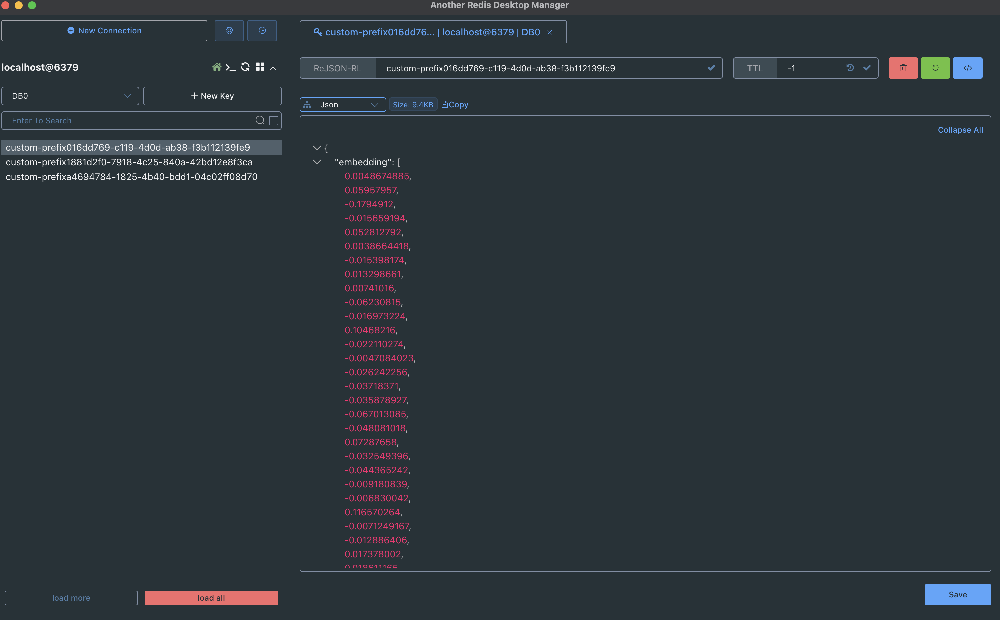
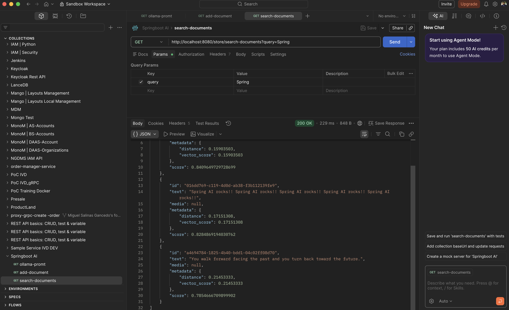

# Description
Poc SpringBoot AI

## Infrastructure
We need to have Ollama install with some models installed:

- **LLM Model**: phi3:3.8b-mini-128k-instruct-q8_0
- **Embedding Model**: nomic-embed-text:v1.5 

We can pull models locally to be used for our Spring Agent

```bash
ollama pull phi3:3.8b-mini-128k-instruct-q8_0
ollama pull nomic-embed-text:v1.5
 ```

We can check the models pulled from Ollama:

```bash
ollama list
NAME                                 ID              SIZE      MODIFIED      
nomic-embed-text:v1.5                0a109f422b47    274 MB    10 days ago      
phi3:3.8b-mini-128k-instruct-q8_0    adc0589ce82e    4.1 GB    10 days ago      
llama3.2:latest                      a80c4f17acd5    2.0 GB    11 months ago
```

Also we need a Vector Database to manage embeddings, we will use Redis. We start the Vector Database Redis as a docker container like this:


```bash
docker run -d \
  --name redis-stack-ai \
  -p 6379:6379 \
  -p 8001:8001 \
  redis/redis-stack:latest
```

We can test our Vector Database Redis using the manager [Another Redis Desktop Manager](https://goanother.com/)



## Test Spring AI

We will use postman for it:



